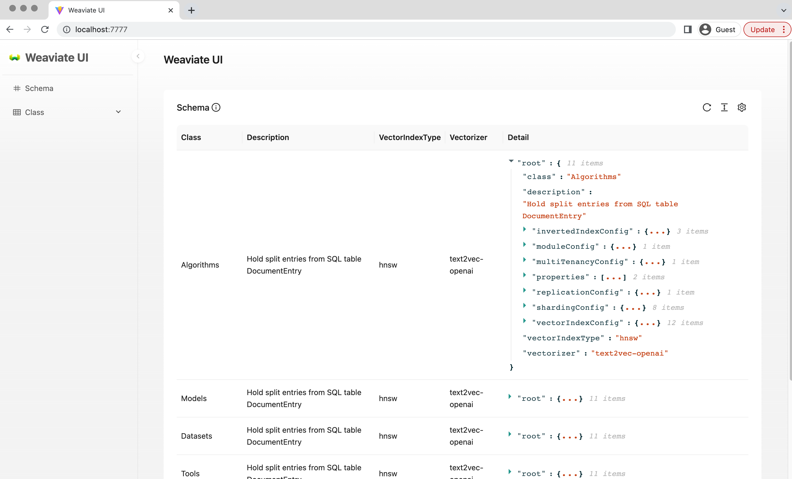

# Weaviate-UI



Weaviate-UI is a web client for interacting with the Weaviate.

## Features

- Schema query
- Data search

## Usage

```bash
$ docker run -e WEAVIATE_URL=http://localhost:8091 -e WEAVIATE_API_KEYS=secret naaive/weaviate-ui:latest
```

## Contribution
Any form of contribution is welcome, including but not limited to submitting bug reports, proposing new features, improving code, etc.